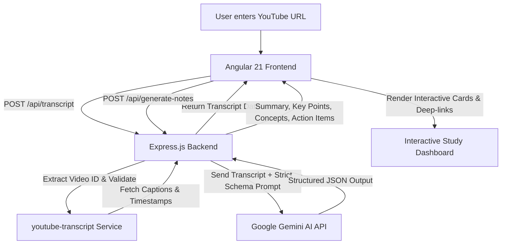

# 🎓 EduScribe AI — AI-Powered YouTube Lecture Note Generator

<div align="center">

[](https://angular.dev/)
[](https://nodejs.org/)
[](https://expressjs.com/)
[](https://aistudio.google.com/)
[](https://opensource.org/licenses/MIT)
[](https://makeapullrequest.com)

<p align="center">
  <strong>Transform lengthy YouTube lectures, webinars, and technical tutorials into crystal-clear, structured, revision-ready study notes in seconds with Google Gemini AI.</strong>
</p>

[Key Features](#-key-features) • [System Architecture](#-system-architecture) • [Tech Stack](#-tech-stack) • [Installation & Setup](#-installation--setup) • [API Documentation](#-api-documentation) • [Project Structure](#-project-structure) • [Troubleshooting](#-troubleshooting--faq)

---

</div>

## 📌 Overview

**EduScribe AI** is an intelligent educational productivity tool designed for students, researchers, developers, and lifelong learners. Watching long academic lectures or technical tutorials on YouTube often leads to passive learning, scattered notes, and countless hours spent rewinding for key points.

EduScribe AI solves this by extracting captions and millisecond-accurate timestamps from any YouTube video (from short clips to 2+ hour university lectures) and utilizing **Google Gemini AI** to produce structured, high-retention study notes.

---

## ✨ Key Features

| Feature | Description |
| :--- | :--- |
| ⚡ **Instant Full Transcript Extraction** | Automatically fetches captions and timestamped segments for short clips or long 2+ hour lectures. |
| 🧠 **Structured AI Notes Generation** | Leverages Gemini AI to generate a 4-part study package: **Executive Summary**, **Key Points**, **Important Concepts**, and **Action Items**. |
| ⏱️ **Interactive Video Timestamps** | Clickable timestamps that instantly deep-link to the exact moment in the YouTube video for quick reference. |
| 🔍 **Live In-Transcript Search** | Search and filter through thousands of spoken words with instant matching and count feedback. |
| 📖 **Dual Reading Modes** | Toggle between **Timestamped Segments Mode** (for studying alongside video) and **Continuous Reading Mode** (for book-like reading). |
| 📋 **One-Click Clipboard Copy** | Easily copy individual summaries, full notes, or entire transcripts with real-time copy confirmation. |
| 📱 **Responsive & Modern UI** | Built with Angular Material, Angular Signals, and clean SCSS with smooth animations. |
| 🛡️ **Robust Error Handling** | Production-ready Express API with resilient fallback handling for missing captions, rate limits, and network errors. |

---

## 🏗️ System Architecture



---

## 💻 Tech Stack

### Frontend
- **Framework:** [Angular 21](https://angular.dev/) (Standalone Components, Signals architecture)
- **UI Components:** [Angular Material](https://material.angular.io/) & CDK
- **Styling:** SCSS, Responsive Design, CSS Grid & Flexbox
- **Icons:** Google Material Symbols / Icons
- **Testing:** [Vitest](https://vitest.dev/) & JSDOM

### Backend
- **Runtime:** [Node.js](https://nodejs.org/) (ES Modules)
- **Framework:** [Express.js](https://expressjs.com/)
- **AI Integration:** Official [`@google/genai`](https://www.npmjs.com/package/@google/genai) SDK
- **AI Model:** Google Gemini (`gemini-3.5-flash-lite` / `gemini-2.5-flash`)
- **Transcript Engine:** [`youtube-transcript`](https://www.npmjs.com/package/youtube-transcript)
- **Configuration:** `dotenv`, `cors`
- **Testing:** Native Node.js Test Runner (`node --test`)

---

## 📁 Project Structure

```
EduScribe-AI/
├── angular-frontend/               # Angular 21 Single Page Application
│   ├── src/
│   │   ├── app/
│   │   │   ├── core/               # Models, services & HTTP interceptors
│   │   │   │   ├── models/         # TypeScript interfaces (Note, Segment, etc.)
│   │   │   │   └── services/       # ApiService (HttpClient calls)
│   │   │   ├── features/           # Feature views
│   │   │   │   └── home/           # Main Lecture Note & Transcript Dashboard
│   │   │   ├── app.config.ts       # Application providers & routing
│   │   │   └── app.routes.ts       # Route declarations
│   │   ├── environments/           # Environment configuration files
│   │   ├── styles.scss             # Global design tokens and theme styles
│   │   └── index.html              # HTML shell
│   ├── package.json
│   └── tsconfig.json
│
├── backend-project/                # Express.js REST API
│   ├── src/
│   │   ├── config/                 # Environment variables & CORS config
│   │   ├── controllers/            # Request handlers (notes, health)
│   │   ├── middlewares/            # Error handling & 404 middleware
│   │   ├── routes/                 # API route definitions
│   │   ├── services/               # Gemini AI & Transcript services
│   │   ├── utils/                  # YouTube URL parser & HTTP error mappers
│   │   ├── app.js                  # Express app composition
│   │   └── server.js               # Server bootstrap & lifecycle
│   ├── .env.example                # Sample environment configuration
│   └── package.json
│
├── package.json                    # Root workspace runner scripts
├── .gitignore
├── LICENSE
└── README.md
```

---

## 🚀 Installation & Setup

### Prerequisites

Ensure you have the following installed on your machine:
- **Node.js**: `v18.18.0` or higher (recommended: `v20.x` or `v22.x`)
- **npm**: `v9.x` or higher
- **Google Gemini API Key**: Obtain a free API key from [Google AI Studio](https://aistudio.google.com/apikey)

---

### Step 1: Clone the Repository

```bash
git clone https://github.com/your-username/EduScribe-AI.git
cd EduScribe-AI
```

---

### Step 2: Configure the Backend

1. Navigate to the `backend-project` folder:
   ```bash
   cd backend-project
   ```

2. Install backend dependencies:
   ```bash
   npm install
   ```

3. Create your `.env` configuration file:
   ```bash
   # On Windows (PowerShell)
   Copy-Item .env.example .env

   # On Linux / macOS
   cp .env.example .env
   ```

4. Edit `.env` and provide your Gemini API Key:
   ```env
   # Server Configuration
   PORT=5000
   NODE_ENV=development

   # CORS Configuration (Angular frontend URL)
   CORS_ORIGIN=http://localhost:4200

   # Google Gemini API
   # Get your key at: https://aistudio.google.com/apikey
   GEMINI_API_KEY=your_actual_gemini_api_key_here
   GEMINI_MODEL=gemini-3.5-flash-lite
   ```

---

### Step 3: Configure the Frontend

1. Open a new terminal and navigate to `angular-frontend`:
   ```bash
   cd angular-frontend
   ```

2. Install frontend dependencies:
   ```bash
   npm install
   ```

3. *(Optional)* Verify API endpoint configuration in [environment.ts](file:///d:/CLG/EduScribe%20-%20AI/AI-Powered%20YouTube%20Lecture%20Note%20Generator/angular-frontend/src/environments/environment.ts):
   ```typescript
   export const environment = {
     production: false,
     apiUrl: 'http://localhost:5000/api'
   };
   ```

---

### Step 4: Run the Application

You can run both services independently or use the root workspace scripts:

#### Option A: Run via Root Monorepo Commands (from project root)
```bash
# Terminal 1: Start Backend
npm run dev:backend

# Terminal 2: Start Frontend
npm run dev:frontend
```

#### Option B: Run from Respective Folders

**Start Backend (Port 5000):**
```bash
cd backend-project
npm run dev
```

**Start Frontend (Port 4200):**
```bash
cd angular-frontend
npm start
```

Open your browser and navigate to: **`http://localhost:4200`**

---

## 📡 API Documentation

### 1. Health Check
Checks if the backend server is running and healthy.

- **Endpoint:** `GET /api/health`
- **Response:** `200 OK`
```json
{
  "status": "ok",
  "uptime": 142.5,
  "timestamp": "2026-10-07T18:40:00.000Z"
}
```

---

### 2. Fetch Video Transcript
Fetches full transcript and timestamped segments for a YouTube video.

- **Endpoint:** `POST /api/transcript`
- **Headers:** `Content-Type: application/json`
- **Request Body:**
```json
{
  "url": "https://www.youtube.com/watch?v=dQw4w9WgXcQ"
}
```
- **Success Response (`200 OK`):**
```json
{
  "success": true,
  "videoId": "dQw4w9WgXcQ",
  "transcriptLanguage": "en",
  "fullText": "Full transcript text here...",
  "segments": [
    {
      "text": "Welcome to this lecture on neural networks.",
      "offset": 1200,
      "duration": 3400
    },
    {
      "text": "Today we will cover backpropagation.",
      "offset": 4600,
      "duration": 2800
    }
  ]
}
```

---

### 3. Generate AI Notes
Generates structured study notes from a YouTube URL or direct transcript text.

- **Endpoint:** `POST /api/generate-notes`
- **Headers:** `Content-Type: application/json`
- **Request Body (Option A - By URL):**
```json
{
  "url": "https://www.youtube.com/watch?v=dQw4w9WgXcQ"
}
```
- **Request Body (Option B - By Pre-fetched Transcript):**
```json
{
  "transcript": "Full lecture transcript text...",
  "videoId": "dQw4w9WgXcQ",
  "transcriptLanguage": "en"
}
```
- **Success Response (`200 OK`):**
```json
{
  "success": true,
  "videoId": "dQw4w9WgXcQ",
  "transcriptLanguage": "en",
  "notes": {
    "summary": "This lecture provides an introduction to neural networks and backpropagation calculus.",
    "keyPoints": [
      "Neural networks optimize weights using gradient descent.",
      "Activation functions introduce non-linearity into the model.",
      "Backpropagation applies the chain rule of calculus across layers."
    ],
    "importantConcepts": [
      {
        "concept": "Gradient Descent",
        "explanation": "An optimization algorithm used to minimize the loss function by iteratively moving in the direction of steepest descent."
      },
      {
        "concept": "Chain Rule",
        "explanation": "Calculus rule used to compute the partial derivatives of the loss with respect to each weight in deep architectures."
      }
    ],
    "actionItems": [
      "Review partial derivatives and matrix multiplication.",
      "Implement a single-layer perceptron from scratch in Python."
    ]
  }
}
```

---

## 🧪 Running Tests

### Backend Unit Tests
Executes native Node.js unit tests for controllers, services, error mappers, and URL validators:
```bash
# From project root:
npm run test:backend

# Or from backend-project directory:
cd backend-project
npm test
```

### Frontend Unit Tests
Executes Vitest unit tests for Angular components and services:
```bash
# From project root:
npm run test:frontend

# Or from angular-frontend directory:
cd angular-frontend
npm test
```

---

## ❓ Troubleshooting & FAQ

<details>
<summary><strong>Q: I get the error: "No captions could be retrieved for that video"</strong></summary>

**A:** Ensure the YouTube video has closed captions (either creator-uploaded subtitles or auto-generated English captions). Videos with disabled captions, private videos, age-restricted videos, or live streams cannot be processed.
</details>

<details>
<summary><strong>Q: I get the error: "GEMINI_API_KEY environment variable is not set"</strong></summary>

**A:** Make sure you have created the `.env` file in `backend-project/.env` and supplied a valid API key from [Google AI Studio](https://aistudio.google.com/apikey). Ensure there are no surrounding quotes or extra spaces.
</details>

<details>
<summary><strong>Q: Can EduScribe process very long videos (e.g., 2 to 3 hour lectures)?</strong></summary>

**A:** Yes! The transcript extractor fetches the complete caption stream, and Google Gemini's large context window processes full multi-hour lecture transcripts seamlessly.
</details>

<details>
<summary><strong>Q: CORS error when calling backend from frontend</strong></summary>

**A:** Check that `CORS_ORIGIN` in `backend-project/.env` matches your frontend origin (default: `http://localhost:4200`).
</details>

---

## 🗺️ Roadmap

- [ ] 📄 **Export to PDF & Markdown**: Download generated notes directly as formatted PDF or `.md` files.
- [ ] 🌐 **Multi-Language Support**: Translate notes and transcripts into 30+ languages.
- [ ] 🗂️ **Interactive Flashcards**: Generate interactive quiz and revision flashcards using Gemini AI.
- [ ] 🎙️ **Audio-to-Text Fallback**: Whisper AI integration for videos without YouTube captions.
- [ ] 💾 **Saved History & Bookmarks**: LocalStorage / Database support for saved lecture archives.

---

## 🤝 Contributing

Contributions, issues, and feature requests are welcome!

1. Fork the Project
2. Create your Feature Branch (`git checkout -b feature/AmazingFeature`)
3. Commit your Changes (`git commit -m 'Add some AmazingFeature'`)
4. Push to the Branch (`git push origin feature/AmazingFeature`)
5. Open a Pull Request

---

## 📄 License

This project is licensed under the **MIT License** — see the [LICENSE](LICENSE) file for details.

---

<div align="center">
  <sub>Built with ❤️ using Angular, Express.js, and Google Gemini AI</sub>
</div>
